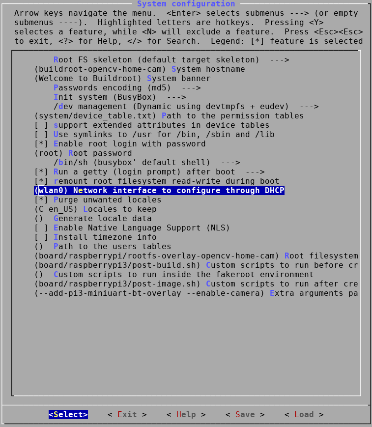
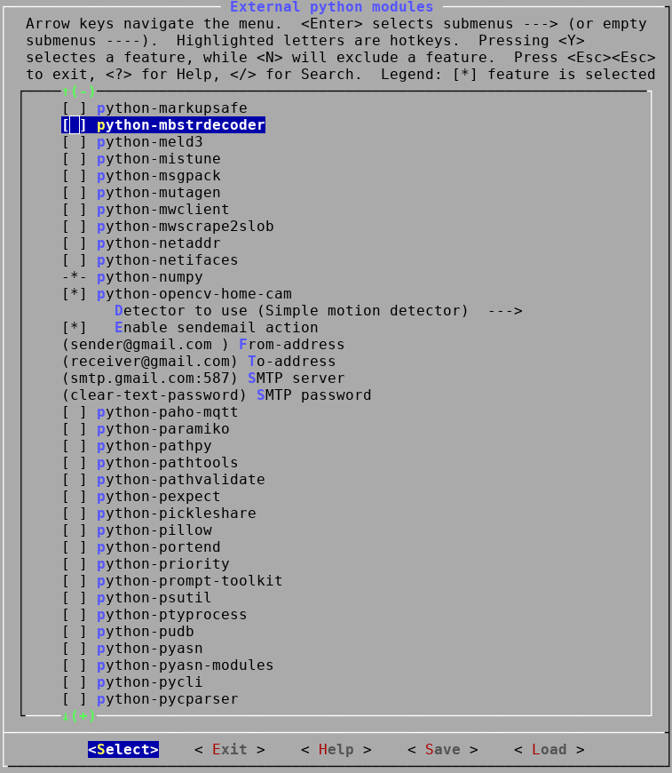

OpenCV + python + rpi + buildroot
=================================

This repository is a fork of buildroot (https://buildroot.org/) intended
to be used with a python tool named *opencv-home-cam*, to create a simple
home surveillance system on a Raspberry Pi 3.

OpenCV and Python3 are added as well as the opencv-home-cam tool.

opencv-home-cam is a simple object detection framework/wrapper built on
top of OpenCV.

See the opencv-home-cam git repository for more details:

https://github.com/erstrom/opencv-home-cam

OpenCV is the computer vision library used by opencv-home-cam:

http://opencv.org/

Everything needed to build the entire system is included (directly or indirectly)
in this repository (depending packages will be fetch automatically from the
internet).

For more information about buildroot, please consult the official buildroot
documentation:

https://buildroot.org/downloads/manual/manual.html

Build instructions
------------------

Below are step-by-step instructions for building an SD-card image containing
opencv-home-cam and its dependecies (basically Python3 and OpenCV) for a
Raspberry Pi 3.

Step 1: clone repository
++++++++++++++++++++++++

Clone the buildroot-opencv git repository:

::

    git clone https://github.com/erstrom/buildroot-opencv.git

The default branch is the recommended branch to use and thus,
there is no need to checkout a custom branch.

Note that the default branch is not *master* which is normally used
as default in most git repositories.
Instead the default branch is *rpi-opencv-dev*.
The *master* branch will be identical to the official buildroot *master*.

Step 2: configuration
+++++++++++++++++++++

Use the defconfig *raspberrypi3_opencv_home_cam_defconfig* as a starting
point for the configuration.
It contains all the necessary configuration options needed to run
opencv-home-cam on a Raspberry Pi 3.

::

    cd buildroot-opencv
    make raspberrypi3_opencv_home_cam_defconfig

Some of the settings need to be customized. These settings are:

- Network configuration: wired or wireless?
- Settings for the opencv-home-cam action scripts: email addresses etc.

Run ``make menuconfig`` in order to start the interactive configuration:

::

    make menuconfig

Network configuration
#####################

Typically, the device will use DHCP to obtain an IP address on the network
(this is by far the most common setup in a home network).

Since the Raspberry Pi 3 has both wired and wireless support, we must select
which interface to use when obtaining an IP address.

The alternatives are:

- eth0 (wired)
- wlan0 (wireless)

The interface to use with DHCP is selected under:

::

    System configuration -> Network interface to configure through DHCP

Change the name of the network interface to either *eth0* or *wlan0*.

The buildroot configuration option is: ``BR2_SYSTEM_DHCP`` (in case you
want to edit *.config* or *configs/raspberrypi3_opencv_home_cam_defconfig*
manually).

Wireless security
_________________

Most wireless home networks use WPA/WPA2 PSK security and we assume this is
the case here as well.

If the wireless network interface is to be used, we must add the security
credentials manually.

This is done by generating a *wpa_supplicant* configuration file and add it
to the rootfs overlay.

The easiest way of adding the configuration file is to generate it with
*wpa_passphrase*:

::

    wpa_passphrase <network ssid> <passphrase> \
        > board/raspberrypi/rootfs-overlay-opencv-home-cam/etc/wpa_supplicant.conf

*wpa_passphrase* takes the SSID and passphrase as arguments and writes
the configuration to stdout.

.. N.B.
    The wpa_supplicant config file must be named wpa_supplicant.conf and
    placed directly under the etc direcory in the overlay since the
    wpa_supplicant init script uses a hardcoded path!

opencv-home-cam
###############

The opencv-home-cam action script configuration is done under:

::

    Target packages -> Interpreter languages and scripting -> python3 ->
    External python modules -> python-opencv-home-cam

The detector type can be selected under ``Detector to use``.
The below screenshot shows a selection where the simple motion detector
is used. The simple motion detector detects motion by diffing consecutive
frames from the camera.

sendemail action
________________

The sendemail action action is enabled by selecting:

::

    Enable sendemail action

The configuration parameters for this action are presented below:

- From-address
- To-address
- SMTP server
- SMTP password

See *example-actions/sendemail.sh* in *opencv-home-cam.git* for a more
detailed explanation of the options.

Step 3: build
+++++++++++++

Once the system is configured properly it is time to build.

To build an SD-card image, just run ``make``:

::

    make

Buildroot will download and build all packages and create the SD-card image
in one step.

The build will take some time (~40-60 minutes depending on the build machine).

The output will be available in *output/images*

Several files will be created, but we only need the SD-card image:
*output/images/sdcard.img*

Step 4: write SD-card
+++++++++++++++++++++

Write the image to the SD-card with *dd*:

::

    dd output/images/sdcard.img /dev/sdX

*/dev/sdX* should be replaced with the path to the SD-card device.

.. N.B.
    Make sure to use the correct sdX device so you don't mess up your
    build machine! Use fdisk or similar to verify that the disk you are
    writing to is the intended SD-card.
